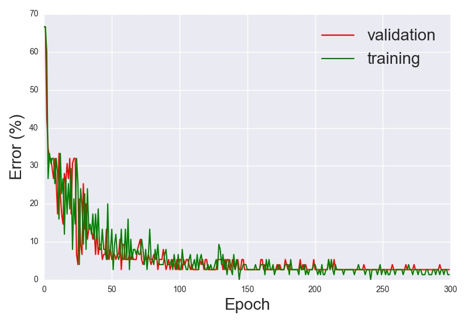

# iris-classification

Simple neural network for Iris dataset classification, using Python (Lasagne + Theano library).

All results written in 'output' folder. Dataset taken from <https://archive.ics.uci.edu/ml/datasets/Iris>.

